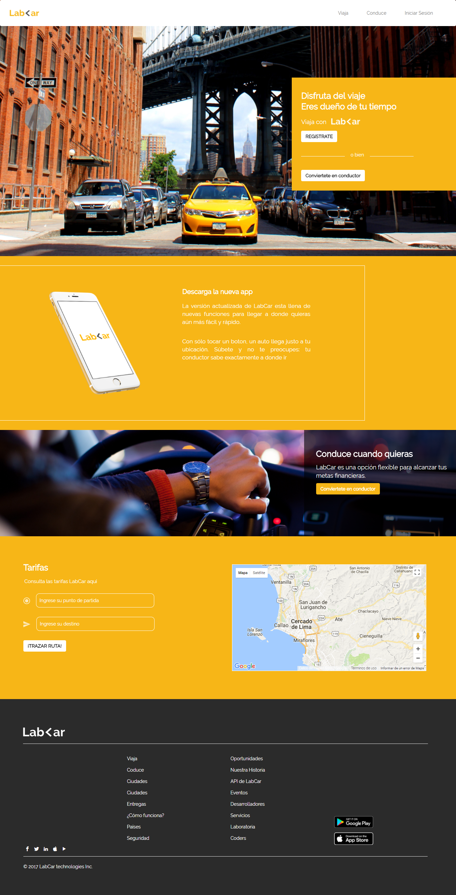
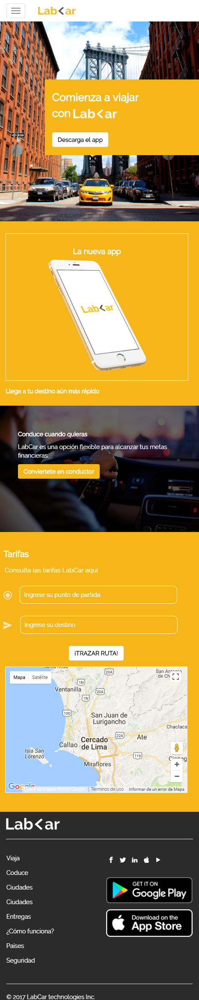
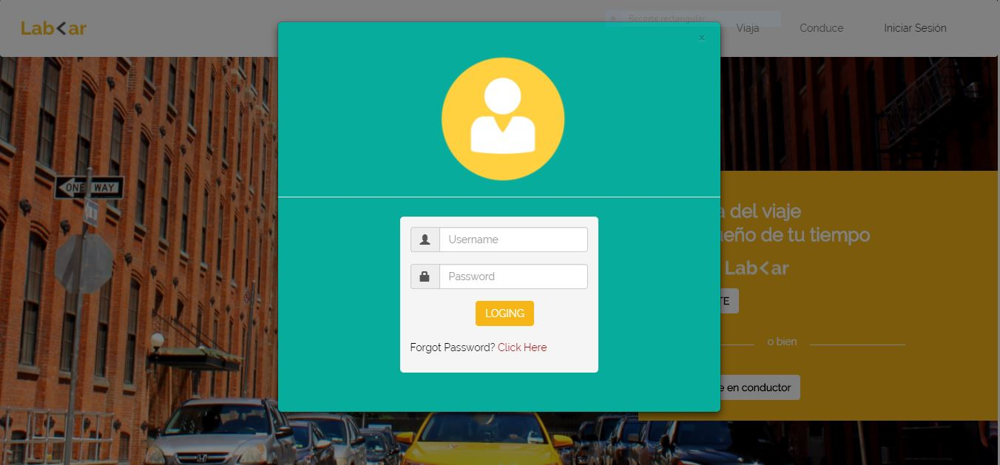
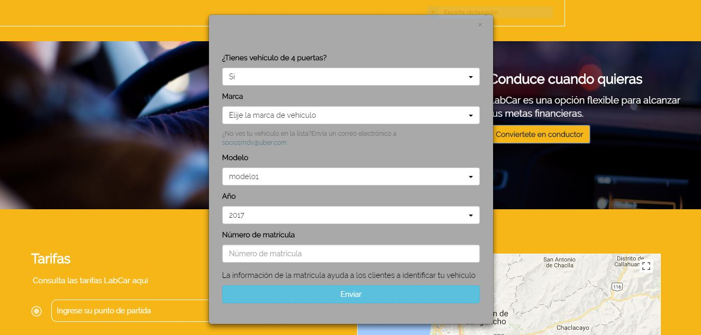
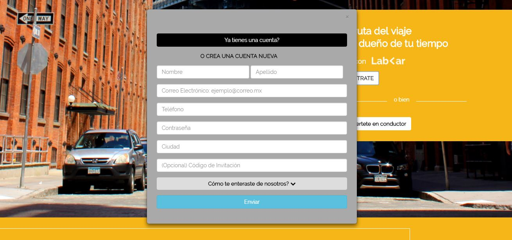

# Reto LAB-<AR
---
## Objetivo

Recrea la página web de LAB-<AR en su versión mobile y desktop utilizando Bootstrap.

## Adicionales

Como extra puedes añadir los modales necesarios en la versión web.
*  Modal Iniciar Sesión
*  Modal Registrate
*  Modal Conviértete en conductor

## Especificaciones de Desarrollo

* La página principal es denominada `index.html` en el cual se encuentra la  estructura del proyecto y se enlaza las hojas de estilos propias y las de Bootstrap.

* En la carpeta `css` se encuentra el archivo `main.css` donde se han agragado los  estilos necesarios para el proyecto.

* En la carpeta `vendors` se encuentran los archivos de Bootstrap.

* En la carpeta `assets` se encuentra la carpeta `images` donde estan las imágenes necesarias para el proyecto.

* Esta web utiliza 1 tipografía :   `Raleway`.

* La paleta de colores se basa en estos tres : `#F7B617`, `#2B2B2B`,
  `#fff`.

* Los íconos se obtuvieron de  [IcoMoon](https://icomoon.io/app/) y de font-awesome.

* En el desarrollo del proyecto se han utilizado diferentes tipos de efectos sobre algunos títulos e imágenes, todo esto especificado en la hoja de estilos main.css.

* Los modales se establecieron con Bootstrap.

* El mapa de ruta se desarrollo con API de google maps y su código de desarrollo se encuentra en el archivo `app.js`

### Versión desktop

### Versión Mobile

### Modales

Realizado por Carla Centeno Ramos.
